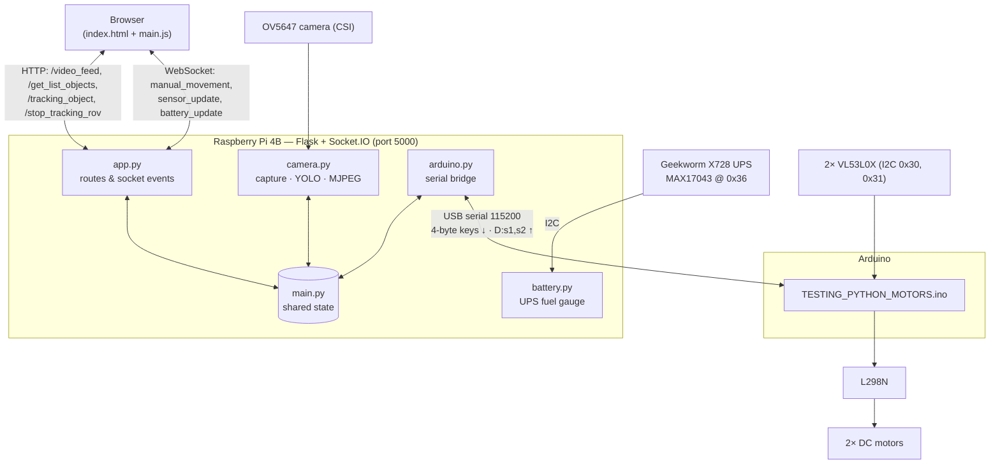

# Pathfinder ROV

A land-based ROV (Remotely Operated Vehicle) driven from a web browser. A Raspberry Pi 4B streams live video with real-time YOLO object detection; the operator can drive the vehicle manually with the keyboard, or select a detected object and let the ROV follow it autonomously. An Arduino handles the low-level work: driving the motors and reading two laser distance sensors for collision avoidance.

> Last updated: **October 2026**. See [Project status & roadmap](#project-status--roadmap) for what works today.

---

## Table of contents

1. [Project idea](#project-idea)
2. [System architecture](#system-architecture)
3. [Hardware](#hardware)
4. [Software](#software)
5. [Communication protocols](#communication-protocols)
6. [Web interface](#web-interface)
7. [Object tracking (autonomous mode)](#object-tracking-autonomous-mode)
8. [Development history](#development-history)
9. [Problems encountered & solutions](#problems-encountered--solutions)
10. [Design considerations](#design-considerations)
11. [Known issues & limitations](#known-issues--limitations)
12. [Project status & roadmap](#project-status--roadmap)
13. [Setup & running](#setup--running)
14. [Repository structure](#repository-structure)
15. [References](#references)

---

## Project idea

The ROV is split into two halves so that each board does what it is good at:

- **Mechanical section — Arduino.** Two DC motors driven through an L298N motor controller. Two VL53L0X time-of-flight laser sensors on the front measure distances up to ~2 m and let the Arduino stop the vehicle before a collision (*collision avoidance*). The Arduino reacts in real time and does not depend on the Pi to stay safe.
- **"Smart" section — Raspberry Pi 4B.** Connected to the Arduino over USB serial. It runs the camera, the object-detection model and the web server. The operator chooses between two driving modes:
  - **Manual mode** — drive with `W` `A` `S` `D`.
  - **Autonomous mode** — pick an object detected by the camera; the ROV steers to keep it centred and drives towards it, up to the collision limit.
- **Communication.** The operator connects to a web page served by the Pi. For remote access outside the local network, the original plan uses a **VPS as a bridge** between the user and the Pi (not implemented yet — see roadmap).


---

## System architecture



**Data flow in one sentence:** the browser sends key states over a WebSocket → `app.py` writes them into the shared `keys[]` list → `arduino.py` forwards them to the Arduino as 4 bytes → the Arduino drives the motors, unless a sensor reports an obstacle. In the other direction, the Arduino sends distance readings that the Pi forwards to the browser, while the camera thread publishes the video stream and the list of detected objects.

---

## Hardware

### Bill of materials

| Component | Model | Role | Notes |
|---|---|---|---|
| Main computer | **Raspberry Pi 4B** | Web server, camera, YOLO inference | |
| Camera | **5MP OV5647 motorised IR-CUT** (Arducam-style, [The Pi Hut](https://thepihut.com/products/5mp-motorised-ir-cut-ov5647-camera-for-raspberry-pi)) | Live video + object detection | 85° FOV, 2.25 mm manual-focus M12 lens, 2 IR LED boards. The IR-cut filter switches **automatically** via an on-board light sensor (no software control on current Raspberry Pi OS) |
| Cooling | **Geekworm P165-B** 11 mm aluminium heatsink + 3010 fan | Keeps the CPU below thermal-throttling during YOLO | Assembly is tight together with the UPS and the CSI ribbon cable |
| UPS / Pi power | **Geekworm X728** ([product page](https://geekworm.com/products/x728)) | Battery backup for the Pi, battery monitoring | 18650 cells, 5.1 V / up to 5 A output, MAX17043 fuel gauge on I2C (`0x36`), DS1307 RTC, AC-loss detection on GPIO6. **Batteries not purchased yet** |
| Microcontroller | **Arduino** (Uno-class) | Motors + distance sensors | USB serial to the Pi (`/dev/ttyACM0`) |
| Motor driver | **L298N** | Drives the two DC motors | |
| Motors | 2× DC motors | Locomotion | Powered by 4× AA NiMH (1.2 V each → 4.8 V), separate from the Pi |
| Distance sensors | 2× **VL53L0X** — new **GY-530** breakouts | Collision avoidance (front) | New boards need header pins soldered; on-board regulator (2.6–5.5 V) |

> Earlier prototypes used a **Geekworm X703** UPS, which has no I2C battery monitoring — this is why the battery panel always showed "N/A". It was replaced by the X728.

### Arduino wiring

| Arduino pin | Connected to | Function |
|---|---|---|
| 9 (`ENA`) | L298N ENA | Motor A speed (PWM) |
| 8 (`IN1`), 7 (`IN2`) | L298N IN1/IN2 | Motor A direction |
| 10 (`ENB`) | L298N ENB | Motor B speed (PWM) |
| 6 (`IN3`), 5 (`IN4`) | L298N IN3/IN4 | Motor B direction |
| 13 (`SHT_LOX1`) | VL53L0X #1 XSHUT | Sensor 1 enable → re-addressed to `0x30` |
| 12 (`SHT_LOX2`) | VL53L0X #2 XSHUT | Sensor 2 enable → re-addressed to `0x31` |
| SDA / SCL | Both VL53L0X | Shared I2C bus |

Both VL53L0X sensors boot at the same I2C address (`0x29`). To use two on one bus, the sketch holds both in reset with **XSHUT**, wakes sensor 1 alone and assigns it `0x30`, then wakes sensor 2 and assigns `0x31`. **On the new GY-530 boards the XSHUT pin must be wired**, otherwise re-addressing fails.


Fritzing sources and PNGs are in [`schemas/`](schemas/).

### Raspberry Pi connections

| Interface | Device | Details |
|---|---|---|
| CSI | OV5647 camera | Detected by libcamera; if not, add `dtoverlay=ov5647` to `/boot/firmware/config.txt` |
| USB | Arduino | `/dev/ttyACM0`, 115200 baud |
| 40-pin header / I2C bus 1 | X728 UPS | MAX17043 fuel gauge `0x36`, RTC `0x68`, AC-loss signal on GPIO6 |
| 5 V / GND | P165-B fan | Always-on |

### Power budget

- The Pi 4B running YOLO + camera + IR LEDs can draw close to **3 A at 5 V**. The X728 supports up to 5 A.
- The **motors are on a separate supply** (AA pack via the L298N). Sharing a supply with the Pi would cause brown-outs and reboots every time the motors start.
- The X728 requires 18650 cells **without** built-in protection circuits (per Geekworm); use reputable brands (Samsung, LG, Sony/Murata, Molicel).

---

## Software

The current code lives in [`Pi/testing/v2/`](Pi/testing/v2/). Older prototypes are kept in [`Pi/testing/v1/`](Pi/testing/v1/) for reference.

### Stack

| Layer | Technology |
|---|---|
| Camera | Picamera2 (libcamera), BGR888 640×480 |
| Detection & tracking | Ultralytics **YOLO11n**, exported to **NCNN** for ARM; `model.track()` gives persistent object IDs |
| Image processing | OpenCV (resize, drawing, JPEG encoding) |
| Backend | Flask + Flask-SocketIO (`async_mode='threading'`) |
| Frontend | HTML + Bootstrap 5 + vanilla JS + Socket.IO client |
| Serial | pyserial |
| Battery | smbus2 (I2C) |
| Microcontroller | Arduino C++ with `Adafruit_VL53L0X` |

### Modules

| File | Responsibility |
|---|---|
| `main.py` | Entry point. Owns **all shared state**, initialises hardware, creates the camera stream and the app, starts background tasks. |
| `app.py` | Flask routes and Socket.IO events. Knows nothing about hardware — it only reads/writes shared state. |
| `camera.py` | Camera init, model loading, `CameraStream` class (three threads). |
| `arduino.py` | `driving_rov()` background task: sends `keys[]` to the Arduino, parses sensor lines, emits `sensor_update`. |
| `battery.py` | `battery_task()`: reads the MAX17043 every 5 s and emits `battery_update`. |
| `templates/index.html` | Single-page UI. |
| `static/main.js` | Keyboard handling, Socket.IO client, object table, sensor and battery panels. |
| `Arduino/TESTING_PYTHON_MOTORS/*.ino` | Arduino sketch currently flashed (v2 binary protocol). |

### Shared state

All mutable state is created in `main.py` and **passed by reference** to the modules that need it (no global `state.py`, no circular imports):

```python
list_objects     = {"fps": None, "objects": []}                          # written by camera, read by /get_list_objects
object_tracked   = {"enabled": False, "object_id": None, "class_name": None}  # written by tracking routes, read by camera
sensor_distances = {"s1": -1, "s2": -1}                                  # written by arduino.py (-1 = out of range)
keys             = [0, 0, 0, 0]                                          # [W, A, S, D]
keys_lock        = threading.Lock()                                      # guards keys
```

### `CameraStream` — three decoupled threads

```
_capture_loop    → grabs frames as fast as the camera allows      → _latest_raw
_inference_loop  → resize to 320×240, YOLO track()                → _boxes, list_objects
generate_frames  → copy of _latest_raw + last boxes (scaled ×2)   → MJPEG to browser (≤30 FPS)
```

Video smoothness no longer depends on how fast YOLO runs: the stream always shows the newest camera frame with the most recent boxes on top.

---

## Communication protocols

### Pi → Arduino (serial, 115200 baud)
Exactly **4 bytes**, `bytes(keys)` = `[W, A, S, D]`, each `0` or `1`. Sent only when the value changes. The Arduino drains its buffer and keeps only the latest 4-byte command.

### Arduino → Pi (serial)
One text line every 200 ms: `D:<s1>,<s2>\n` in millimetres, `-1` = out of range. Example: `D:120,-1`. Any other line is printed to the Pi console for debugging.

### Browser ↔ Pi

| Direction | Channel | Name | Payload |
|---|---|---|---|
| Browser → Pi | WebSocket | `manual_movement` | `{w, a, s, d}` booleans, every 50 ms (not sent while tracking) |
| Pi → Browser | WebSocket | `sensor_update` | `{s1, s2}` mm |
| Pi → Browser | WebSocket | `battery_update` | `{voltage, percent}` (null if unreadable), every 5 s |
| Browser → Pi | HTTP GET | `/video_feed` | MJPEG stream |
| Browser → Pi | HTTP GET | `/get_list_objects` | JSON object list, polled every 1 s |
| Browser → Pi | HTTP POST | `/tracking_object` | `{object_id, class_name}` — start tracking |
| Browser → Pi | HTTP POST | `/stop_tracking_rov` | `{object_id, class_name}` — stop tracking |

---

## Web interface

Open `http://<raspberry-pi-ip>:5000` from any device on the same network.

| Input | Action |
|---|---|
| `W` / `S` | Forward / backward |
| `A` / `D` | Turn left / right |
| No key | Stop |
| Window loses focus | Safety stop (all keys released) |
| Any key while tracking | Tracking cancelled → back to manual |

**Panels**

- **Live Video Feed** — 640×480 MJPEG with bounding boxes and FPS counter.
- **Objects Detected** — table refreshed every second (ID, class, confidence; only detections with confidence > 0.5). **Track** starts autonomous mode; **Stop tracking** returns to manual. While tracking, the tracked row is highlighted, other rows are dimmed and Track buttons are disabled.
- **Distance Sensors** — two bars, colour-coded: green > 200 mm, blue 100–200 mm, yellow ≤ 100 mm, red ≤ 50 mm. A pulsing red banner appears when an obstacle is within 50 mm.
- **Battery** — charge % and voltage from the UPS fuel gauge.


---

## Object tracking (autonomous mode)

Goal: after the operator clicks **Track**, the ROV turns so the selected object stays in the centre of the frame and drives towards it, stopping at the collision limit. Implemented in four phases, each tested before the next.

| Phase | Description | Status |
|---|---|---|
| 1 — Visual | Tracked object drawn in red with a `TRACKING:` label, other boxes hidden; table highlights the target and disables Track buttons | ✅ Done |
| 2 — Steering | In the inference thread, find the target by ID, compare its centre X with the frame centre (160 px at 320×240): left of dead zone → turn left, right → turn right, centred → forward, not found → stop | ⬜ To do |
| 3 — Safety | `/stop_tracking_rov` immediately zeroes the motors; if the target is missing for > 1 s, stop and notify the browser (`tracking_lost`) | ⬜ To do |
| 4 — UI feedback | "TRACKING: \<class\>" banner, "target lost" warning | ⬜ To do |

**Planned design for Phase 2:** the tracker writes to a separate `auto_keys[]` list, and `driving_rov()` sends `auto_keys` while tracking is enabled and `keys` otherwise. This keeps manual and autonomous commands from overwriting each other and restores manual control automatically when tracking stops. The Arduino's obstacle check applies to both modes, so autonomous driving also stops before a collision.

---

## Development history

| Period | Milestone |
|---|---|
| Nov – Dec 2025 | Project setup, component ordering, schematics. First tests: Pi camera photos/video, Pi streaming over Flask, L298N + motors, single and multiple VL53L0X sensors (XSHUT re-addressing). |
| Dec 2025 | Python ↔ Arduino motor control over serial; Pi local streaming. |
| Jan 2026 | Object detection with YOLO on the Pi (YOLO11n, NCNN export), JSON list of detected objects. |
| Feb 2026 | Frontend (Bootstrap table, fetch polling, Socket.IO), backend receives the object to track; keyboard-based driving. |
| Mar 2026 | **Manual driving working end to end** (browser → Pi → Arduino → motors). |
| Apr 2026 | **v2 refactor**: monolithic script split into `main/app/camera/arduino`; three-thread camera pipeline; binary 4-byte serial protocol; distance-sensor panel and obstacle banner. v1 moved to `Pi/testing/v1/`. |
| May 2026 | Battery panel (UPS fuel gauge), tracking Phase 1 (visual), sensor-emit fix. |
| Oct 2026 | Hardware upgrades: Geekworm X728 UPS, P165-B heatsink + fan, new GY-530 VL53L0X boards. Documentation rewrite. |

---

## Problems encountered & solutions

| # | Problem | Cause | Solution |
|---|---|---|---|
| 1 | Video stream at **~2.5 FPS** | YOLO ran inline in the stream generator, so stream FPS = inference FPS | Moved inference to its own thread |
| 2 | After that, FPS dropped to **2.2** | A single inference thread + a busy-looping generator: the generator stole CPU through the Python GIL | Three threads (capture / inference / stream) and a `sleep(1/30)` cap in the generator |
| 3 | Inference still slow | YOLO on 640×480 | Inference on a **320×240** copy (4× fewer pixels); boxes scaled ×2 for drawing |
| 4 | Unneeded colour conversion every frame | Camera configured as RGB | Capture directly in `BGR888` (OpenCV's native order) |
| 5 | Heavy MJPEG frames | Default JPEG quality 95 | Quality 75 |
| 6 | Two VL53L0X sensors conflicted | Both use I2C address `0x29` at boot | XSHUT sequencing → `0x30` / `0x31` |
| 7 | Laggy / queued motor commands | Arduino processed every buffered command in order | Arduino drains the buffer and keeps only the latest 4 bytes; Pi sends only on change |
| 8 | Fragile text protocol (v1) | String parsing on the Arduino | Binary 4-byte `[W,A,S,D]` protocol (v2). **The v1 sketch must not be flashed with v2 code** |
| 9 | Baud-rate mismatches in test sketches | Some sketches used 9600 | Everything standardised on **115200** |
| 10 | Socket flooded with sensor events | `sensor_update` emitted for every parsed line | Parse all pending lines, emit once per loop |
| 11 | Battery always "N/A" | The old **X703 UPS has no I2C fuel gauge**; on one attempt the address showed as `UU` (claimed by a kernel driver) | Replaced with the **X728** (MAX17043 at `0x36`). `battery.py` must be pointed at I2C bus 1 — see roadmap |
| 12 | Tight mechanical fit (heatsink + UPS + CSI ribbon) | P165-B is 11 mm tall | Use a 2×20 header extension if boards touch; avoid sharp bends in the ribbon (causes intermittent "camera not detected") |

---

## Design considerations

- **Why split Arduino and Pi?** The Pi is busy with YOLO and its Linux scheduler is not real-time. The Arduino guarantees that obstacle stops happen within one sensor cycle (~200 ms) regardless of the Pi's load.
- **Why NCNN?** Ultralytics recommends NCNN for ARM boards such as the Raspberry Pi; it is significantly faster than running the PyTorch model. A comparison with `yolov8n` and `yolov5n` (NCNN) is planned.
- **Why `track()` instead of `predict()`?** Tracking gives each object a persistent ID across frames, which is what lets the user select "this person" and the ROV keep following the same one.
- **Why pass state by reference?** `main.py` owns everything; modules receive only what they need. No hidden globals, no circular imports, and hardware can be disabled for testing by commenting two lines.
- **Why `app.py` never touches the Arduino?** Separation of concerns: web code writes intentions (`keys[]`), a single background task owns the serial port.
- **Why WebSocket for driving and HTTP for the object list?** Driving needs low-latency, frequent updates (every 50 ms); the object list is fine at 1 Hz with simple polling.
- **Safety layers:** the window losing focus releases all keys; any key during tracking returns to manual; the Arduino stops on obstacles regardless of the command.
- **Night operation:** with the IR LEDs on, the camera image is black and white. YOLO is trained on colour images, so detection accuracy is expected to drop in the dark — to be measured.
- **Local server / VPS offloading:** because the Pi reaches only a few FPS with YOLO11n, the plan includes testing inference on an external machine (an old HP laptop simulating a VPS) and comparing latency vs. on-board inference.

---

## Known issues & limitations

- **Obstacle stop also blocks reversing.** The Arduino stops the motors whenever a sensor reads ≤ 50 mm, *including* when the user presses `S`. Since both sensors face forward, backing away from an obstacle should be allowed.
- **Battery reading uses the wrong I2C bus.** `battery.py` opens `SMBus(0)`; on the Pi 4B the header I2C (where the X728 lives) is **bus 1**.
- **Binary protocol has no framing.** If a byte is ever lost, the 4-byte commands can go out of alignment. A start byte or checksum would make it robust.
- **Turning is a one-wheel pivot** at a fixed PWM (115). Speed is not adjustable from the UI; proportional control needs a protocol upgrade.
- **Inference FPS after the v2 optimisations has not been measured on hardware yet** (expected ~4–8 FPS inference, ~20 FPS stream).
- **Local network only** — no authentication, no remote access yet.
- `object_tracked` is updated without a lock; acceptable for now (single writer per field), but worth revisiting with the steering logic.

---

## Project status & roadmap

Legend: ✅ done · 🔄 needs testing on hardware · ⬜ to do

### Hardware
- ✅ Motors + L298N tested
- ✅ Two VL53L0X on one bus (XSHUT re-addressing)
- ✅ OV5647 camera via CSI
- ✅ Pi ↔ Arduino USB serial
- 🔄 Solder and install the new **GY-530** sensors (wire XSHUT)
- 🔄 Mount **P165-B** heatsink + fan together with UPS and camera
- ⬜ Buy 18650 cells and install the **X728** UPS
- ⬜ Final chassis assembly

### Camera & detection
- ✅ Picamera2 stream, YOLO11n NCNN, three-thread pipeline, 320×240 inference
- 🔄 Measure inference / stream FPS on the Pi
- ⬜ Compare YOLO11n vs YOLOv8n vs YOLOv5n (NCNN)
- ⬜ Test detection at night (IR mode)
- ⬜ Show inference FPS and CPU temperature in the UI

### Driving
- ✅ Manual WASD driving end to end
- ✅ Arduino obstacle stop (≤ 50 mm)
- ⬜ Allow reversing when an obstacle is in front
- ⬜ Serial framing (start byte / checksum)

### Autonomous tracking
- ✅ Phase 1 — visual
- ⬜ Phase 2 — steering (`auto_keys`, dead zone)
- ⬜ Phase 3 — safety (stop on command, target-lost timeout)
- ⬜ Phase 4 — UI feedback
- ⬜ Keep distance using bounding-box size
- ⬜ Proportional / PID control (requires speed values in the serial protocol)
- ⬜ Search behaviour when the target is lost

### Power
- ✅ Battery panel in the UI
- ⬜ Point `battery.py` to I2C bus 1, verify with `i2cdetect -y 1`
- ⬜ Safe shutdown on low battery / AC loss (X728 GPIO6)

### Networking
- ✅ Local network access
- ⬜ Offload inference to a local server (simulated VPS) and compare
- ⬜ Remote access through a VPS bridge

---

## Setup & running

### Raspberry Pi

```bash
# 1. System
sudo raspi-config            # Interface Options → enable I2C and Camera
sudo apt install -y python3-picamera2 i2c-tools

# 2. Virtual environment (with system packages, so Picamera2 is visible)
python3 -m venv --system-site-packages venv
source venv/bin/activate
pip install flask flask-socketio ultralytics opencv-python pyserial smbus2

# 3. YOLO model (NCNN), placed in Pi/testing/ so that v2 finds it at ../yolo11n_ncnn_model
yolo export model=yolo11n.pt format=ncnn

# 4. Check devices
ls /dev/ttyACM*              # Arduino → /dev/ttyACM0
i2cdetect -y 1               # X728 fuel gauge → 36
libcamera-hello --list-cameras

# 5. Run
cd Pi/testing/v2
python main.py               # → http://<pi-ip>:5000
```

### Arduino

1. Install the **Adafruit_VL53L0X** library in the Arduino IDE.
2. Flash `Pi/testing/v2/Arduino/TESTING_PYTHON_MOTORS/TESTING_PYTHON_MOTORS.ino`.
3. Connect the Arduino to the Pi via USB.

---

## Repository structure

```
Pathfinder_ROV/
├── README.md                         ← this file
├── architettura_pathfindeer.drawio   ← architecture diagram (draw.io)
├── picamera2-manual.pdf
├── schemas/                          ← Fritzing wiring diagrams
└── Pi/
    └── testing/
        ├── v1/                       ← early prototypes (text protocol, monolithic server)
        │   ├── Arduino/              ← component test sketches (motors, sensors, serial)
        │   └── *.py                  ← camera, streaming, detection, serial tests
        └── v2/                       ← current system
            ├── main.py  app.py  camera.py  arduino.py  battery.py
            ├── templates/index.html
            ├── static/main.js
            └── Arduino/TESTING_PYTHON_MOTORS/
```

---

## References

- Ultralytics — [NCNN export](https://docs.ultralytics.com/integrations/ncnn/#why-export-to-ncnn), [Object tracking](https://docs.ultralytics.com/modes/track/)
- [Picamera2 manual](picamera2-manual.pdf)
- [Geekworm X728](https://geekworm.com/products/x728) · [X728 wiki](https://wiki.geekworm.com/X728)
- [Geekworm P165-B](https://geekworm.com/products/p165-b)
- [OV5647 motorised IR-CUT camera — The Pi Hut](https://thepihut.com/products/5mp-motorised-ir-cut-ov5647-camera-for-raspberry-pi)
- [Adafruit VL53L0X library](https://github.com/adafruit/Adafruit_VL53L0X)
- [Flask-SocketIO](https://flask-socketio.readthedocs.io/)
